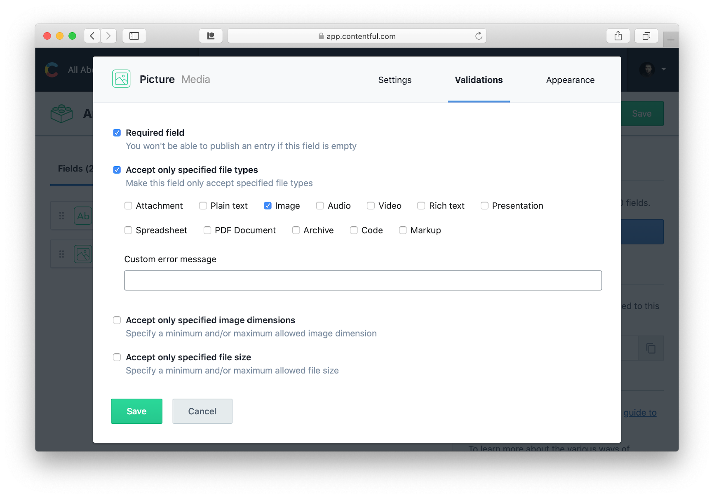

# Creating a Website with Stacy

This is a tutorial/walkthrough that explains step-by-step how to create and publish a simple website using Stacy.

Let's create a website that will tell people what humanity knows about various animals we love to have as our pets. The website will have a single page with a title followed by a number of modules that will follow the same template, one for each pet kind. Each module will have a title, a picture and some description text. Something like the following:


## Step 1: Content Model

For this step, first create a space in your [Contentful](https://www.contentful.com) account. This space will hold all the dynamic content for your website.

Now, we need to define our content model. We are going to need two content types defined: one for the top page as a whole, and one for the article modules. Let's start with the article module. To do that, go to your space's _Content model_ and add a new content type:


Note the content type's _Api Indentifier_ "article", which we will need later when we create a template for it.

Now, let's add fields to the article content type. We will need three: one for the article title, one for the pet picture and one for the description.

To add title field, click _Add field_ button, select _Text_ field type, enter the field name "Title" and click _Create and configure_ button. In the _Settings_ tab of the following dialog check the _This field represents the Entry title_ checkbox:


Also note the _Field ID_ "title", which we will use to refer to the field's value in the module template.

In the _Validations_ tab make the field required by checking _Required field_ checkbox:


And save the field.

Now, let's add the picture field. Click _Add field_ button again, pick _Media_ this time, enter name "Picture" and proceed to _Create and configure_. In the _Validations_ make the field required and also make sure that only images are accepted:



Save the field.

Finally, let's add the description field. Click _Add field_ again, select _Text_, type in "Description" into the _Name_ field and pick _Long text, full-text search_ option this time:


Click _Create and configure_ button, make the field required in the _Validations_ tab, and make sure that in the _Appearance_ tab the field uses _Markdown_ option. This will allow the authors to use rich text for the field, including different size fonts, bold, italic, multiple paragraphs, etc.

Note: Another option is to use a _Rich Text_ field for the description.

Now, once we have all the three fields in place, save the content type:


Go back to the _Content model_ and click _Add content type_ to create our second content type—the one for the page as a whole. Enter "Page" for the content type name and hit _Create_.

We are going to need two fields for this content type: the page caption and the list of article modules to include.

Let's start with the caption. Click _Add field_ button, pick _Text_, type in "Caption" into the field name input, and hit _Create and configure_. In the field's _Settings_ tab check the _This field represents the Entry title_ checkbox. In the _Validations_ tab check the _Required field_ checkbox. And save the field.

Now, let's add the articles. Click _Add field_ button again and pick _Reference_ for the field type this time around. The _Reference_ type allows the field to refer other entities, which in our case will be our _Article_ entities. Type in "Articles" into the field name input and select _Many references_ option (the authors should be able to include multiple articles on the page, not just one):


Proceed to _Create and configure_. In the _Validations_ tab specify that only entries of type _Article_ can be used for the field:


And save the field.

Before we save the content type, there is one more special field that needs to be added— the _slug_ field. Every content type that corresponds to a page as a whole (as opposed to an includable module) must have a field named "slug". The field will be used to define at what URL the page will be available in the target website. For example, if we create an entry of content type _Page_ and we provide the slug as "my-best-page", the page will be available in our website under URL "/my-best-page.html".

Let's create the field. Click _Add field_ one more time, select _Text_ field type and enter "Slug" for the field name (make sure the _Field ID_ is "slug"—this is the ID Stacy will expect it to be). Proceed to _Create and configure_. In the _Validations_ make the field required, unique (every page entry has to have its own unique slug to correspond to a unique page URL in the target website) and also check the _Match a specific pattern_ checkbox. Enter pattern "^\w[\w-]*(/\w[\w-]*)*$" (it is a regular expression):


In the _Appearance_ tab pick _Slug_:


And save the field and the content type.

Our content model is complete.

## Step 2: Add Initial Content

Now, that our content model is ready, let's add some initial content. We are going to have one page and two articles: one for dogs and one for cats.

Let's start with the articles. Go to the _Content_ section of your Contentful space and add an _Article_ entry. You will see the user interface that your content authors will be using to maintain your website. Enter the title "Dogs", then use _Create new asset and link_ to upload a picture of your favorite puppy (use _Publish_ button to save the picture once uploaded and click arrow back in the top left corner of the dialog to return to the atricle form). Make sure that it says "PUBLISHED" at the top of the picture. In the description field type in a few nice words about dogs and hit _Publish_ to save the article entry.

Go back to the _Content_ and add another _Article_ entry for the cats.

Now we can add an entry for our main page. Click _Add entry_ and pick _Page_ content type this time. In the caption field type in "What We Know About Pets". Then for the articles select _Link existing entries_ option and select both article entries we just created for dogs and cats.

In the slug field overwrite the default value Contentful has put there for you and enter "index". This will make the page to be generated at "/index.html" in our website.

Publish the entry and we are done with the content!

## Step 3: Create Website Project

Once we have our content model and some initial content in place, we can create our website project where we will have templates for our pages and modules.

Some prerequisites:

* Make sure you have [Node.js](https://nodejs.org/en/) version 10.16.3 or newer installed along with NPM (Node.js comes with it).

* For publishing your website in [Amazon Cloud](https://aws.amazon.com/) you will need [AWS CLI](https://aws.amazon.com/cli/) installed and configured to access your AWS account.

* Know [Handlebars](https://handlebarsjs.com/), which is the language used in Stacy for the templates.

* Get your space ID and your Content Delivery API access token from Contentful. To do that, in your Contentful account go to _Space settings_→_API keys_. Then either add a new API key or use an existing one (Contentful automatically created "Example Key 1" for you when you create the new space). Find values in fields _Space ID_ and _Content Delivery API - access token_ below it.

First, install Stacy package globally:

```
npm install -g stacy
```

Next, change to the directory where you will want your website project development environment to live and generate new project:

```
stacy new --cf-space <your space ID> --cf-access-token <your API access token> allaboutpets
```

This will create a project directory called "allaboutpets" in your current directory. The "allaboutpets" is known as the _site ID_.

Inside your project directory, go to `/static` and replace `styles.css` with something like this:

```css
html, body { height: 100%; }
body { margin: 0; font-family: "Helvetica Neue", sans-serif; }

h1, h2, figure, p { margin: 0; }

body > header { padding: 16px 48px; }
body > header > h1 { text-align: center; }

main { padding: 0 48px 48px 48px; }

article:not(:first-child) { margin-top: 16px; }

article > header { margin-bottom: 16px; border-bottom: 1px solid; }

article > .content { display: flex; }
article > .content > figure > img { width: 120px; }
article > .content > .description { margin-left: 32px; font-size: large; }
```

The contents of the `/static` directory are copied over to the target website as-is. Therefore, this is a good place for your stylesheets, images used in the website design, fonts, or even some static HTML pages that are not going to be maintained by the authors in Contentful.

Now, in the `/templates` directory of your project let's create templates for our two content types: the page and the article.

Let's start with the article. As you remember, our content type ID in Contentful is "article", so the template file has to be `article.hbs`. The name of the template file (sans the extension) must match exactly to the content type ID (not name!) to be associated with it. Put the following in `article.hbs`:

```handlebars
<article>
  <header>
    <h2>{{title}}</h2>
  </header>
  <div class="content">
    <figure>
      {{{asset picture}}}
    </figure>
    <div class="description">{{{markdown description}}}</div>
  </div>
</article>
```

As you can see, we can use our entry fields defined in the _Article_ content type directly in the template. A couple of notes though:

* We used `asset` helper for the picture. The `asset` helper is one of the custom Handlebars helpers Stacy provides for you. This one renders an HTML `` element for a media field. See Stacy manual for the full list of helpers.

  Since the `asset` helper outputs HTML, triple-braces must be used so that Handlebars does not try to escape it.

* The `description` field is rendered using another Stacy helper `markdown`. In Contentful long text fields are stored using [Markdown](https://en.wikipedia.org/wiki/Markdown). Stacy's `markdown` helper converts the Markdown syntax into HTML. As with the `asset` helper, note the triple-braces needed since `markdown` outputs HTML.

* Contentful field IDs are used to refer to the entry fields, not the names.

Now, let create a template for our _Page_ content type. In `page.hbs` put the following:

```handlebars
<!DOCTYPE html>
<html lang="en">
  <head>
    <meta charset="utf-8">
    <title>{{caption}}</title>
    <link href="styles.css" rel="stylesheet">
  </head>
  <body>
    <header>
      <h1>{{caption}}</h1>
    </header>
    <main>
      {{#each articles}}{{{module this}}}{{/each}}
    </main>
  </body>
</html>
```

Note that we use another Stacy helper `module`. This helper includes the module referred by the reference field. Also note that triple-braces are used to that Handlebars does not escape the included module's HTML.

We are ready to try our website now. Let's start local Stacy server using:

```
stacy serve
```

Once running, in your browser open `http://localhost:8080` and you should see your website!

While Stacy is running the local server, you can make changes in the templates, files in the `/static` directory or change the content in Contentful. Reload the page in the browser and you will immediately see the changes.

To stop the server, hit `Ctrl+C`.

## Step 4: Create Stacy Infrastructure in AWS

Once you are satisfied with the website, you can publish it in AWS. Stacy publishes your site in an [Amazon S3](https://aws.amazon.com/s3/) bucket called _target bucket_. The website can be made available on the Internet either directly from it or via [Amazon CloudFront](https://aws.amazon.com/cloudfront/). Once the site is published, Stacy receives notifications from Contentful about content changes via entry and asset _publish_ and _unpublish_ events. When it receives these notifications, it automatically regenerates pages affected by the content change and updates them in the target S3 bucket. This allows your content authors to maintain the website without involvement from the website developers.

To do all the above, Stacy needs certain infrastructure in your AWS account. Before we can create it, we need to meet certain prerequisites:

* In your AWS account, create an S3 bucket for your website&mdash;the target bucket. Make sure that the bucket is configured to serve web content either directly or via CloudFront (see [Hosting a Static Website on Amazon S3](https://docs.aws.amazon.com/AmazonS3/latest/dev/WebsiteHosting.html) for details).

  Alternatively, you can use an existing bucket and configure Stacy to publish your website in a subfolder in it.

* Create another S3 bucket (with the default configuration) for Stacy's [AWS Lambda](https://aws.amazon.com/lambda/) function package. This package includes the Stacy's _publisher_, which is the piece that responds to _publish_ and _unpublish_ events from Contentful and updates the content in the target S3 bucket.

For our purposes, let's assume you created the target S3 bucket with name "allaboutpets" and the Lambda functions bucket with name "allaboutpets-lambda".

Now, build the publisher package in your project:

```
stacy build-publisher
```

This created a zip archive called `stacy-allaboutpets-publisher.zip` in your project's `/build` directory. Upload this zip file to your Lambda S3 bucket (the "allaboutpets-lambda" bucket) either using the AWS Console or the CLI:

```
aws s3 cp build/stacy-allaboutpets-publisher.zip s3://allaboutpets-lambda
```

Once you have the buckets and the publisher Lambda package in place, you can create Stacy infrastructure. In your project, Stacy has generated an [AWS Cloud​Formation](https://aws.amazon.com/cloudformation/) template at `/misc/cfn-template.json`. Use it to create a CloudFormation stack in your AWS account. When you create the stack, it uses some required and optional parameters to configure it. You will have to enter the name of the Lambda functions S3 bucket ("allaboutpets-lambda"), the target S3 bucket ("allaboutpets") and Contentful Content Delivery API access token. You can leave the rest of the stack parameters with their default values.

To create the stack you can either use AWS Console or use AWS CLI. For example:

```
aws cloudformation create-stack --stack-name stacy-allaboutpets --template-body file:misc/cfn-template.json --capabilities CAPABILITY_NAMED_IAM --parameters "ParameterKey=LambdaFunctionsBucket,ParameterValue=allaboutpets-lambda" "ParameterKey=TargetBucket,ParameterValue=allaboutpets" "ParameterKey=ContentfulAccessToken,ParameterValue=xxxxxxxxx"
```

Then wait for the stack creation completion:

```
aws cloudformation wait stack-create-complete --stack-name stacy-allaboutpets
```

Once the stack is created, you have to adjust target [S3 bucket policy](https://docs.aws.amazon.com/AmazonS3/latest/dev/using-iam-policies.html) to allow Stacy's publisher update files in it. The bucket policy should include something like the following:

```json
{
    "Version": "2012-10-17",
    "Statement": [
        {
            "Effect": "Allow",
            "Principal": {
                "AWS": "<publisher IAM role ARN>"
            },
            "Action": [
                "s3:PutObject",
                "s3:DeleteObject"
            ],
            "Resource": "arn:aws:s3:::allaboutpets/*"
        }
    ]
}
```

You can find the publisher IAM role ARN in the CloudFormation stack's output parameter called `PublisherRoleArn`, which in turn can be found in the AWS Console, or via the AWS CLI:

```
aws cloudformation describe-stacks --stack-name stacy-allaboutpets
```

Once that's done, you have completed setting up Stacy infrastructure in AWS and everything is ready for your website deployment.

## Step 5: Publish the Website

Once you have your AWS infrastructure in place, you can publish your website. To do that, you have to connect your project development environment with your target AWS environment. Find `.env` file in your project directory and open it. In it you will find a bunch of variable that start with "AWS_" prefix. Edit them and provide correct values. Value for the `AWS_PUBLISH_EVENT_SOURCE_MAPPING` variable you can find in the CloudFormation stack's output parameter called `PublishEventSourceMappingId`.

After `.env` is configured, you can perform the initial website publishing by using:

```
stacy publish --keep-publisher-enabled
```

Your website should be now in your target S3 bucket!

As a website developer, you will use Stacy's `publish` command every time you make changes in the project (templates, static content). It completely updates the published content and the Stacy publisher function.

## Step 6: Configure Contentful Webhook

A major feature of Stacy is automatic regeneration of published content when authors change content in Contenful. To enable that we have to configure a [Contentful Webhook](https://www.contentful.com/developers/docs/concepts/webhooks/).

Stacy exposes an endpoing in [Amazon API Gateway](https://aws.amazon.com/api-gateway/) that receives Contentful's _publish_ and _unpublish_ events for entries and assets. We need to find the endpoint's URL and the special API key needed to call it. Go to AWS Console and select API Gateway service. Find "Stacy: allaboutpets" API in the _APIs_ section, go to _Stages_ and expand _prod_ stage. There, take the endpoint's _Invoke URL_:


Now, go to the _API Keys_ and select "Stacy: allaboutpets" key. Click _Show_ next to the _API key_ and take the key value.

Now go to your Contentful space, navigate to _Space settings_&rarr;_Webhooks_ and click _Add Webhook_. Give it a name (e.g. "Stacy Publisher") and enter the API Gateway URL in the _URL_ input (leave the method "POST").

Then, in the _Triggers_ section, pick _Select specific triggering events_ option and check four checkboxes in rows _Entry_ and _Asset_ and columns _Publish_ and _Unpublish_.

Then, in the _Headers_ section, click _Add secret header_ link. For the header key enter "X-API-Key" and in the value field enter the API Gateway key.

Once you save the webhook, automatic Stacy publisher becomes enabled and you can edit content in Contentful and see the updates reflected in your published website.

This completes this tutorial. Happy websiting!
